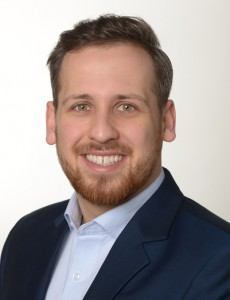

  
  

Welcome to my personal homepage. I am a postdoctoral researcher at [GESIS](https://gesis.org) in Mannheim Germany.

[Institute Homepage](https://www.gesis.org/institut/mitarbeiterverzeichnis/person/?tx_gextstaffdir_staffdirectory%5bemail%5d=Tobias.Heycke@gesis.org&tx_gextstaffdir_staffdirectory%5baction%5d=details&tx_gextstaffdir_staffdirectory%5bcontroller%5d=Index&no_cache=1) |
[Curriculum vitae](#curriculum-vitae) |
[Publications](#publications) |
[Talks & Teaching](#talks-&-teaching) |
[Links](#links)

# Curriculum vitae

Lorem ipsum dolor sit amet, consectetur adipiscing elit. In ac cursus tellus. Praesent ullamcorper dapibus felis sit amet egestas. Aliquam et felis ut metus placerat eleifend a ut arcu. Cras efficitur facilisis felis, ultrices ultricies nulla mattis sed. Curabitur lacus dolor, lacinia id mollis quis, dictum ut orci. Quisque vitae lacinia risus, eget egestas elit. Duis placerat quis sapien non cursus. In id iaculis mi. Etiam sit amet egestas enim, in tincidunt enim. Mauris lectus justo, scelerisque a imperdiet eget, ultrices rhoncus dolor. Aliquam sed pretium sem. Proin rutrum turpis mi, quis posuere arcu aliquet et. Donec pellentesque ante vitae sem maximus ornare. Curabitur venenatis ipsum mi, nec rhoncus lectus facilisis in. Pellentesque sed iaculis lacus. Integer vel dignissim enim, sit amet imperdiet quam.

Nulla a placerat metus. In suscipit porta elit non porta. Sed mattis ipsum ac magna elementum laoreet. Sed et hendrerit justo, vitae convallis magna. Etiam eleifend felis ac nulla dignissim, ut accumsan est semper. Nam eget aliquam velit. Pellentesque eget enim erat. Maecenas fringilla eros sed ipsum gravida, at placerat nisl vulputate.

Mauris consectetur sem lacus. Vestibulum lacus massa, pretium nec felis vel, fringilla bibendum dui. Vestibulum pellentesque, elit sit amet dictum tincidunt, nisl mauris vestibulum.

# Publications

Lorem ipsum dolor sit amet, consectetur adipiscing elit. In ac cursus tellus. Praesent ullamcorper dapibus felis sit amet egestas. Aliquam et felis ut metus placerat eleifend a ut arcu. Cras efficitur facilisis felis, ultrices ultricies nulla mattis sed. Curabitur lacus dolor, lacinia id mollis quis, dictum ut orci. Quisque vitae lacinia risus, eget egestas elit. Duis placerat quis sapien non cursus. In id iaculis mi. Etiam sit amet egestas enim, in tincidunt enim. Mauris lectus justo, scelerisque a imperdiet eget, ultrices rhoncus dolor. Aliquam sed pretium sem. Proin rutrum turpis mi, quis posuere arcu aliquet et. Donec pellentesque ante vitae sem maximus ornare. Curabitur venenatis ipsum mi, nec rhoncus lectus facilisis in. Pellentesque sed iaculis lacus. Integer vel dignissim enim, sit amet imperdiet quam.

Nulla a placerat metus. In suscipit porta elit non porta. Sed mattis ipsum ac magna elementum laoreet. Sed et hendrerit justo, vitae convallis magna. Etiam eleifend felis ac nulla dignissim, ut accumsan est semper. Nam eget aliquam velit. Pellentesque eget enim erat. Maecenas fringilla eros sed ipsum gravida, at placerat nisl vulputate.

Mauris consectetur sem lacus. Vestibulum lacus massa, pretium nec felis vel, fringilla bibendum dui. Vestibulum pellentesque, elit sit amet dictum tincidunt, nisl mauris vestibulum.

# Publications

Lorem ipsum dolor sit amet, consectetur adipiscing elit. In ac cursus tellus. Praesent ullamcorper dapibus felis sit amet egestas. Aliquam et felis ut metus placerat eleifend a ut arcu. Cras efficitur facilisis felis, ultrices ultricies nulla mattis sed. Curabitur lacus dolor, lacinia id mollis quis, dictum ut orci. Quisque vitae lacinia risus, eget egestas elit. Duis placerat quis sapien non cursus. In id iaculis mi. Etiam sit amet egestas enim, in tincidunt enim. Mauris lectus justo, scelerisque a imperdiet eget, ultrices rhoncus dolor. Aliquam sed pretium sem. Proin rutrum turpis mi, quis posuere arcu aliquet et. Donec pellentesque ante vitae sem maximus ornare. Curabitur venenatis ipsum mi, nec rhoncus lectus facilisis in. Pellentesque sed iaculis lacus. Integer vel dignissim enim, sit amet imperdiet quam.

Nulla a placerat metus. In suscipit porta elit non porta. Sed mattis ipsum ac magna elementum laoreet. Sed et hendrerit justo, vitae convallis magna. Etiam eleifend felis ac nulla dignissim, ut accumsan est semper. Nam eget aliquam velit. Pellentesque eget enim erat. Maecenas fringilla eros sed ipsum gravida, at placerat nisl vulputate.

Mauris consectetur sem lacus. Vestibulum lacus massa, pretium nec felis vel, fringilla bibendum dui. Vestibulum pellentesque, elit sit amet dictum tincidunt, nisl mauris vestibulum.

# Talks & Teaching

## Selection of seminars

Lorem ipsum dolor sit amet, consectetur adipiscing elit. In ac cursus tellus. Praesent ullamcorper dapibus felis sit amet egestas. Aliquam et felis ut metus placerat eleifend a ut arcu. Cras efficitur facilisis felis, ultrices ultricies nulla mattis sed. Curabitur lacus dolor, lacinia id mollis quis, dictum ut orci. Quisque vitae lacinia risus, eget egestas elit. Duis placerat quis sapien non cursus. In id iaculis mi. Etiam sit amet egestas enim, in tincidunt 

## Selection of workshops

enim. Mauris lectus justo, scelerisque a imperdiet eget, ultrices rhoncus dolor. Aliquam sed pretium sem. Proin rutrum turpis mi, quis posuere arcu aliquet et. Donec pellentesque ante vitae sem maximus ornare. Curabitur venenatis ipsum mi, nec rhoncus lectus facilisis in. Pellentesque sed iaculis lacus. Integer vel dignissim enim, sit amet imperdiet quam.

Nulla a placerat metus. In suscipit porta elit non porta. Sed mattis ipsum ac magna elementum laoreet. Sed et hendrerit justo, vitae convallis magna. Etiam eleifend felis ac nulla dignissim, ut accumsan est semper. Nam eget aliquam velit. Pellentesque eget enim erat. Maecenas fringilla eros sed ipsum gravida, at placerat nisl vulputate.

## Selection of conference talks

Mauris consectetur sem lacus. Vestibulum lacus massa, pretium nec felis vel, fringilla bibendum dui. Vestibulum pellentesque, elit sit amet dictum tincidunt, nisl mauris vestibulum.

[Complete List of all presentations](pages/talks.md)

# Links

- My [OSF repository](https://osf.io/q5eak)
- [Twitter](https://twitter.com/TobiasHeycke)
- [orcid](http://orcid.org/0000-0001-6358-6713)
- Former group at [University of Cologne](http://methexp.uni-koeln.de/?page_id=1618&lang=de)
- [Writing your dissertation in Markdown and papaja](http://rpubs.com/theycke/380678)
